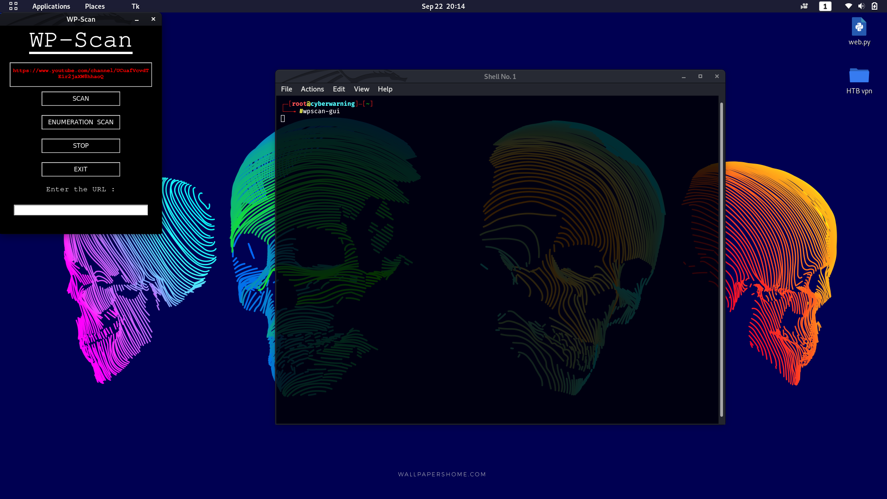
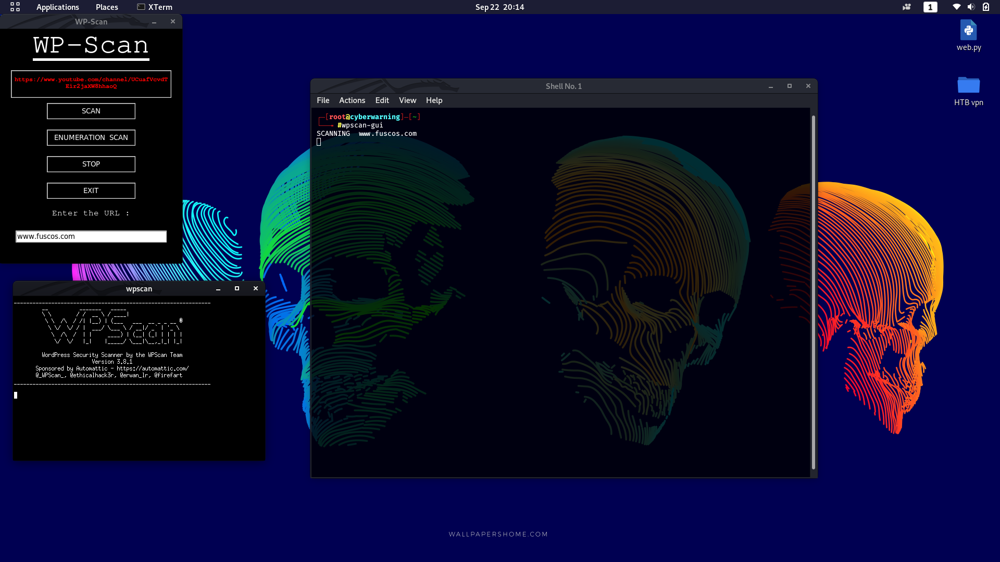

# WpScan-GUI

OUR YOUTUBE LINK :https://www.youtube.com/channel/UCuafVcvdTEir2jaXW8hhaoQ

#INSTALL

1.git clone https://github.com/blackhacker3/WpScan-GUI.git

2.cd WpScan-GUI

3.chmod +x insall.sh

4.sudo bash install.sh

5.Type "wpscan-gui" in any terminal to use the tool

